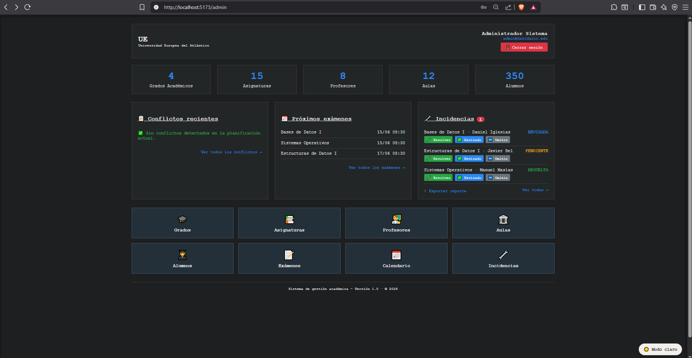

<h1 align="center">Davidario - Generador de Calendarios de Exámenes</h1>

<p align="center">
  
</p>

<div align="center">

[](/README.md)
[](/QUE_HACE.md)
[](/RUP/00-requisitos/00-modelo-del-dominio/README.md)
[](/RUP/00-requisitos/01-casos-de-uso/0-Actores/README.md)
[](/RUP/00-requisitos/01-casos-de-uso/2-DiagramaDeContexto/README.md)
[](/RUP/00-requisitos/01-casos-de-uso/4-DetallarCasosDeUso/README.md)
[](/RUP/00-requisitos/01-casos-de-uso/5-Prototipo/README.md)
[](/RUP/00-requisitos/01-casos-de-uso/3-PriorizarCasosDeUso/README.md)
[](/RUP/00-requisitos/03-sesiones/README.md)
[](/conversation-log.md)

</div>

<p align="center">
  
  <br>
  <i>Panel del Administrador: gestión académica, generación y consulta del calendario de exámenes.</i>
</p>

---

## ¿Qué es Davidario?

**Davidario** es un sistema que **genera, organiza y permite consultar** calendarios de exámenes académicos, coordinando **asignaturas, aulas, profesores y alumnos**. Sustituye la planificación manual en hojas de cálculo por una **generación automática** que asigna fecha, hora, aula y profesor a cada examen, detecta conflictos y publica el calendario para su consulta y descarga por rol.

> Descripción funcional de referencia (primer commit): [`QUE_HACE.md`](/QUE_HACE.md).

### ¿Qué?
Un generador automático del calendario de exámenes de la universidad: a partir de los exámenes, aulas, profesores y matrículas registrados, produce una planificación coherente (fecha, hora, aula y profesor) y la pone a disposición de cada actor.

### ¿Por qué?
La programación manual mediante **hojas de Excel** consume mucho tiempo, es propensa a **errores humanos** y dificulta detectar **conflictos** de horario, de aula o de disponibilidad de profesores.

### ¿Para qué?
Para **automatizar la planificación**: ahorrar tiempo, reducir errores y ofrecer información organizada y fiable. El personal administrativo gestiona y genera; profesores y alumnos consultan y descargan un calendario claro y consistente.

### ¿Cómo?
Con una aplicación web de tres capas: un **backend NestJS + Prisma** sobre **PostgreSQL** que centraliza los datos y ejecuta el **motor de generación** (asigna recursos respetando el **aforo** de las aulas y dejando **al menos un día libre entre exámenes del mismo grado y año**, evitando solapamientos de aula y profesor); y un **frontend React** desde el que cada rol inicia sesión, consulta su calendario y lo descarga en **CSV o PDF**.

---

## Stack Tecnológico

<div align="center">


</div>

* **Frontend:** [React](https://react.dev/) + [TypeScript](https://www.typescriptlang.org/) + [Vite](https://vitejs.dev/) — SPA con enrutado por rol (`/admin`, `/profesor`, `/alumno`) y un tema claro/oscuro seleccionable.
* **Backend:** [NestJS](https://nestjs.com/) (Node.js + TypeScript) — arquitectura modular (módulos por dominio: exámenes, profesor, alumno, incidencias…), autenticación **JWT** y autorización por rol mediante *guards*.
* **ORM / Base de datos:** [Prisma](https://www.prisma.io/) sobre [PostgreSQL 16](https://www.postgresql.org/), con migraciones versionadas.
* **Exportación:** calendario descargable en **CSV** (con BOM para Excel) y **PDF** (`pdfkit`).

---

## Roles del sistema

| Rol | Acceso |
|-----|--------|
| `Administrador` | Gestión de datos base (grados, asignaturas, exámenes, aulas, alumnos, profesores), **generación automática** del calendario, detección de conflictos, gestión de incidencias y consulta/descarga global. |
| `Profesor` | Consulta y descarga del calendario de **sus** exámenes asignados, y **comunicación de incidencias** de horario (con seguimiento de su estado y resolución). |
| `Alumno` | Consulta y descarga del calendario de los exámenes de **sus asignaturas matriculadas**. |

> La autorización se basa **únicamente en el rol del JWT**: cualquier usuario con el rol correspondiente accede a su espacio, sin validaciones por usuario concreto. Esta autorización se aplica de **extremo a extremo** — rutas protegidas por rol en el frontend y *guards* JWT en el backend (un único `@Roles` + guard común) —, de modo que ningún rol puede acceder al espacio ni a la API de otro.

---

## Metodología de Desarrollo

El proyecto sigue el proceso **RUP (Rational Unified Process)**, con entregables por disciplina que pueden explorarse en el repositorio:

1. **[Requisitos](/RUP/00-requisitos/README.md):** modelo del dominio, actores, casos de uso, diagramas de contexto, priorización y prototipos.
2. **[Análisis](/RUP/01-analisis/README.md):** modelado MVC de los casos de uso (diagramas de colaboración).
3. **[Diseño](/RUP/02-diseño/README.md):** arquitectura técnica y diagramas de secuencia de diseño.
4. **[Desarrollo](/RUP/03-desarrollo/README.md):** informes de implementación de cada caso de uso sobre el stack React + NestJS.

> El avance se documenta de forma cronológica en [`conversation-log.md`](/conversation-log.md).

---

## Inicio rápido

**Requisitos previos:** Node.js, PostgreSQL 16 en marcha y un archivo `src/backend/.env` con `DATABASE_URL` (y, opcionalmente, `JWT_SECRET` / `JWT_EXPIRES_IN`).

```bash
# 1. Backend (NestJS + Prisma)
cd src/backend
npm install
npx prisma migrate deploy   # aplica las migraciones a PostgreSQL
npx prisma generate
npm run start:dev

# 2. Frontend (React + Vite) — en otra terminal
cd src/frontend
npm install
npm run dev
```

El backend queda en `http://localhost:3000` y el frontend en `http://localhost:5173`.

> Script de inicialización de la base de datos disponible en [`src/database-setup.sql`](/src/database-setup.sql).

---

## Estructura del repositorio

```
25-26-idsw2-sdVC/
├── README.md               ← este archivo
├── QUE_HACE.md             ← descripción funcional (primer commit)
├── conversation-log.md     ← registro cronológico de las sesiones de construcción
├── AGENTES.md              ← guía operativa de las sesiones (metodología)
├── RUP/                    ← artefactos por disciplina RUP
│   ├── 00-requisitos/
│   ├── 01-analisis/
│   ├── 02-diseño/
│   └── 03-desarrollo/
├── modelosUML/             ← fuentes .puml de todos los diagramas
├── images/                 ← SVGs/figuras exportadas y capturas
└── src/                    ← código fuente
    ├── backend/            ← NestJS + Prisma
    ├── frontend/           ← React + TypeScript + Vite
    └── database-setup.sql  ← inicialización de PostgreSQL
```

---

## Artefactos obligatorios

| # | Artefacto | Ubicación |
|---|-----------|-----------|
| 0 | `QUE_HACE.md` | [Descripción funcional](/QUE_HACE.md) (primer commit, sin modificar) |
| 1 | `README.md` | Este archivo |
| 2 | Código fuente | [`/src`](/src/README.md) (backend y frontend) |
| 3 | Diagramas UML | [Fuentes `.puml`](/modelosUML) · [SVGs](/images) |
| 4 | Documentación RUP | [Requisitos](/RUP/00-requisitos/README.md) · [Análisis](/RUP/01-analisis/README.md) · [Diseño](/RUP/02-diseño/README.md) · [Desarrollo](/RUP/03-desarrollo/README.md) |
| 5 | `conversation-log.md` | [Registro de sesiones](/conversation-log.md) |

---

<div align="center">
<i>Universidad Europea del Atlántico · Ingeniería del Software II · Metodología RUP + vibecoding</i>
</div>